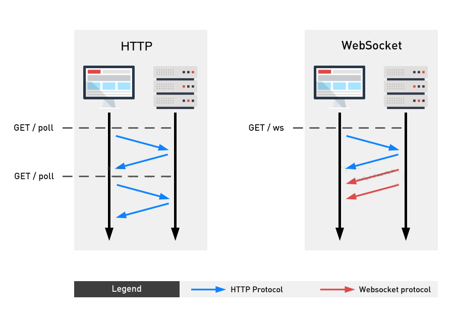

# WebSockets with a Rails API and React Frontend (ActionCable)

## What are WebSockets?

- WebSocket is a communication protocol that allows for a long-held single TCP socket connection
- Bi-directional realtime communication between servers and clients

## ActionCable Basics

- ActionCable is Rails' built-in library with both server-side and client-side components to push data through WebSockets.

- ActionCable has 2 main concepts we should understand:

**Connections** represent the WebSocket link between the server and the client. Every WebSocket connection has a corresponding Connection object, which serves as parent to any Channel instance created off of the connection. Connection objects are mostly concerned with authorization and identification.

**Channels**: Each consumer (client) can subscribe to multiple cable channels. Channels build upon connections, and serve as repositories for code that handles messages sent by consumers, or that you want to broadcast to particular streams. For every message “action” that is sent by the consumer, you must have a method with a matching name in the channel class to handle that message.

### Good To Know

- ActionCable runs a 3 second heartbeat on all connections to check if any connection is stale
- ActionCable assumes all payloads are JSON encoded strings, so we need to make sure to stringify our data (more about this later)
